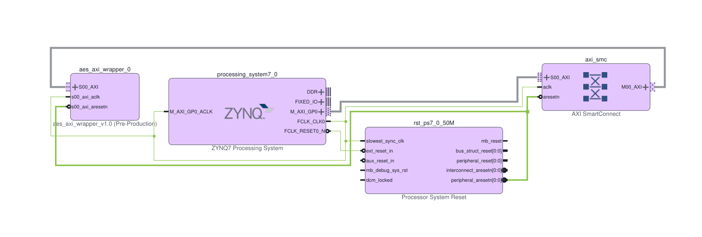

# Hardware AES-128 Accelerator on PYNQ-Z2 (Zynq-7000)

-green.svg)

## Overview
This repository contains a synthesizable RTL implementation of an **Advanced Encryption Standard (AES-128)** hardware accelerator, integrated into a Xilinx Zynq-7000 SoC (PYNQ-Z2 / XC7Z020). 

The project demonstrates an end-to-end FPGA hardware-software co-design workflow: from modular RTL design in SystemVerilog and simulation verification to logic synthesis, AXI4 system interconnect routing, and on-board bare-metal C execution with real-time hardware profiling.

## Architecture and System Design

The system is structurally divided into a high-speed cryptographic PL (Programmable Logic) core and a processor-controlled SoC wrapper.

### 1. AES-128 Cryptographic Core (`myip_0`)
The core performs 128-bit encryption using a compact, iterative Finite State Machine (FSM). By recycling a single hardware round module across 10 encryption rounds, the design minimizes register and LUT utilization while maintaining high clock frequencies.
* **`aes_core.sv`**: The top-level controller and datapath. Requires exactly **11 clock cycles** to encrypt a 128-bit block.
* **Transformations**: Modular, synthesizable implementations of standard NIST FIPS-197 steps (`aes_sbox.sv`, `aes_shift_rows.sv`, `aes_mix_columns.sv`).
* **`aes_key_expand.sv`**: Performs on-the-fly round key scheduling to save Block RAM (BRAM) resources.

### 2. AXI4 System Integration (SoC Block Design)
To expose the PL accelerator to the ARM Cortex-A9 Processing System (PS), the peripheral is wrapped in a custom AXI4-Lite interface (`design_1.bd`).
* **Memory-Mapped Registers:** The PS writes the 128-bit Key, 128-bit Plaintext, and assertion control flags directly to the core's address space (`0x00`–`0x34`).
* **AXI SmartConnect:** Manages bus routing and domain bridging between the ARM PS master and PL slave peripherals.
* **AXI Timer IP (`axi_timer_0`):** Integrated directly into the PL fabric at 100 MHz to provide cycle-accurate hardware profiling without ARM CPU cache or OS latency artifacts.

---
> **System Architecture Block Design**
> 
> 
---

## On-Board Hardware Validation & Benchmarking

The accelerator was deployed and tested on the physical **PYNQ-Z2** board using a bare-metal C driver developed in Xilinx Vitis. The software validates the hardware against standard NIST FIPS-197 test vectors over JTAG/UART and logs execution metrics.

* **Functional Validation:** The hardware core successfully encrypts plaintext blocks, matching NIST reference ciphertexts (e.g., Plaintext `3243f6a8 885a308d 313198a2 e0370734` with Key `2b7e1516 28aed2a6 abf71588 09cf4f3c` 
yields Ciphertext `3925841D 02DC09FB DC118597 196A0B32`).
* **Hardware Profiling:** Using the on-chip AXI Timer running at the 100 MHz PL clock domain, a 10,000-block benchmark was executed to measure total system latency and effective throughput.

---
> **Live Terminal Execution Log (PYNQ-Z2 UART)**
> 
> 
---

### Architectural Bottleneck Analysis (Theory vs. Reality)
A key finding of this hardware-software profiling is the difference between pure core throughput and effective system bandwidth:

$$\text{Theoretical Core Throughput} = \frac{128 \text{ bits}}{11 \text{ cycles} \times 10^{-8} \text{ s}} \approx \mathbf{1.16 \text{ Gbps}}$$

* **Pure Hardware Latency (11 cycles / 110 ns):** The PL encryption engine accounts for only **~4%** of the total execution time per block.
* **Bus I/O Overhead (260.5 cycles / 2,605 ns):** In AXI4-Lite, transmitting one 128-bit block requires 9 sequential word-writes (Key + Text + Start) and 5 word-reads (Status polling + Ciphertext out). Crossing the PS-to-PL boundary 14 times consumes **~96%** of the total block processing time, resulting in an effective system throughput of **~47.15 Mbps**.
* **Architectural Conclusion:** While AXI4-Lite is ideal for low-footprint control registers, achieving Gbps-scale throughput in an SoC environment requires transitioning the data interface to **AXI4-Stream paired with a DMA (Direct Memory Access)** controller for burst-transfer pipelining without ARM CPU intervention.

## Implementation & Performance Results

The core was synthesized and implemented for the **Xilinx Zynq-7000 XC7Z020** SoC (Part: `xc7z020clg400-1`). The iterative architecture achieves closure with substantial positive timing slack and negligible PL power dissipation.

| Metric | Result (XC7Z020) | Details |
| :--- | :--- | :--- |
| **Target Clock Frequency** | 100 MHz (10.0 ns constraint) | Driven by Zynq PS FCLK0 domain |
| **Setup WNS (Worst Negative Slack)** | **+2.909 ns** | High frequency scaling headroom (~125 MHz+) |
| **Hold WHS (Worst Hold Slack)** | **+0.053 ns** | Zero hold violations |
| **AES Core LUTs (`myip_0`)** | **1,439** (~2.7% Utilization) | Reduced area via iterative round sharing |
| **AES Core Registers/FFs (`myip_0`)** | **650** (~0.6% Utilization) | Compact datapath pipeline |
| **Total System LUTs (with Timer & AXI)** | **2,136** (~4.0% Utilization) | Includes `axi_timer_0` and AXI SmartConnect |
| **Total System Registers/FFs** | **1,367** (~1.3% Utilization) | Complete PL system footprint |
| **Total On-Chip Power** | **1.429 W** | PS7: 1.256 W (97%), PL Logic/Signals: **0.038 W** |
| **Theoretical HW Throughput** | **~1.16 Gbps** | 128 bits / 11 PL cycles @ 100 MHz |
| **Effective System Throughput** | **~47.15 Mbps** | Real on-board measurement via AXI Timer |
| **Total System Latency per Block** | **2,715 ns** (271.5 PL cycles) | Includes AXI4-Lite PS-PL read/write overhead |

## Build & Run Instructions

### 1. Hardware Reconstruction (Vivado)
1. Open Xilinx Vivado and create a new project targeting the **PYNQ-Z2** board (`xc7z020clg400-1`).
2. Add all SystemVerilog sources from `aes.srcs/sources_1/new/`.
3. To regenerate the SoC diagram, open the TCL Console and source the exported design script:
   ~~~tcl
   source design_1.tcl
   ~~~
4. Run **Synthesis**, **Implementation**, and click **Generate Bitstream**.
5. Export the hardware platform for software development: `File > Export > Export Hardware` (ensure **Include bitstream** is checked to generate the `design_1_wrapper.xsa` archive).

### 2. Software Validation (Vitis IDE / Bare-Metal C)
1. Launch **Xilinx Vitis IDE** and set the workspace to the repository root or your desired directory.
2. Create a new **Platform Project** using the generated `design_1_wrapper.xsa` hardware archive.
3. Create a new **Application Project** (standalone) targeting the ARM Cortex-A9 processor (`ps7_cortexa9_0`).
4. Import the bare-metal C application sources from `app_component/src/`.
5. Connect the PYNQ-Z2 board via USB-UART and PROG/JTAG, set the boot jumpers to **JTAG mode**, and power on the board.
6. Open a serial terminal (for example, MobaXterm) connected to the board's COM port at **115200 baud** (8 data bits, no parity, 1 stop bit).
7. Right-click the C application project and select `Run As > Launch on Hardware`. 
8. Verify that the NIST FIPS-197 validation checks print `>>> PASS <<<` and the 10,000-block benchmark metrics are output directly to the terminal console.

---
## License
This project is open-source and available under the [MIT License](LICENSE).
